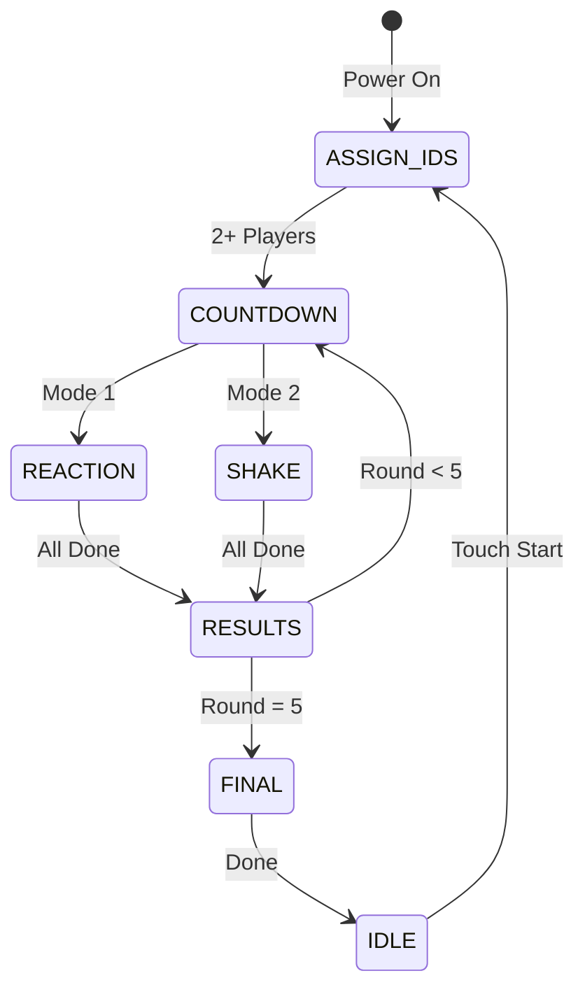

# 🎮 Reaction Time Duel

[](https://www.espressif.com/)
[](LICENSE)
[]()

> **4-player competitive reaction time game in a portable briefcase with detachable joysticks.**


---

## ✨ Features

- 🕹️ **4 Detachable Joysticks** — USB-C connected, each with button + vibration motor
- 📺 **7" Touch Display** — Real-time game status and results
- 💡 **NeoPixel LED Rings** — Visual feedback for each player
- 🔊 **Audio Feedback** — Voice announcements and sound effects
- 🎯 **Two Game Modes** — Reaction time & Shake detection
- 📦 **Portable Briefcase** — Take the party anywhere

---

## 🏗️ Hardware Architecture

```
┌─────────────────┐     Shared UART Bus      ┌──────────────────┐
│   ESP32 Host    │◄────────────────────────►│  ESP32-S3 Display│
│  (DEVKIT-V1)    │     (9600 baud)          │    (7" LCD)      │
└────────┬────────┘                          └──────────────────┘
         │
         ├── GPIO17 TX ──────┬──────────┬──────────┬──────────►
         ├── GPIO16 RX ◄─────┼──────────┼──────────┼───────────
         ├── GPIO19 GO ──────┼──────────┼──────────┼──────────►
         └── GPIO18 RST ─────┼──────────┼──────────┼──────────►
                             ▼          ▼          ▼
                        ┌────────┐ ┌────────┐ ┌────────┐ ┌────────┐
                        │Stick 1 │ │Stick 2 │ │Stick 3 │ │Stick 4 │
                        │ATtiny85│ │ATtiny85│ │ATtiny85│ │ATtiny85│
                        └────────┘ └────────┘ └────────┘ └────────┘
```

---

## 📋 Pin Assignments

> ⚠️ **PCB is printed — DO NOT CHANGE these pins!**

<details>
<summary><b>ESP32 Host (DEVKIT-V1)</b></summary>

| GPIO | Function | Connection |
|:----:|:---------|:-----------|
| 17 | TX2 | → All joysticks RX + Display RX |
| 16 | RX2 | ← All joysticks TX + Display TX |
| 18 | CC1/RST | → Joysticks reset signal |
| 19 | CC2/GO | → Joysticks timing sync |
| 4 | DIN | → NeoPixel rings (5 × 12 LEDs) |
| 23 | I2S DOUT | → MAX98357A amplifier |
| 26 | I2S BCLK | → MAX98357A |
| 25 | I2S LRC | → MAX98357A |

</details>

<details>
<summary><b>ATtiny85-20P Joystick</b></summary>

| Pin | PB# | Function | Notes |
|:---:|:---:|:---------|:------|
| 5 | PB0 | RX + SDA | ⚡ Shared |
| 6 | PB1 | TX | |
| 7 | PB2 | SCL + GO | ⚡ Shared |
| 2 | PB3 | Button | Pull-up + debounce |
| 3 | PB4 | Motor | Via BC547 transistor |
| 1 | PB5 | Reset | From CC1 |

</details>

<details>
<summary><b>USB Type-C Connector</b></summary>

| USB Pin | Signal | Direction |
|:-------:|:------:|:----------|
| D+ | RX | Host → Joystick |
| D- | TX | Joystick → Host |
| CC1 | RST | Host → Joystick |
| CC2 | GO | Host → Joystick |
| VBUS | +5V | Power |

</details>

---

## 📡 Communication Protocol

### Packet Format (7 bytes)
```
┌───────┬─────────┬────────┬─────┬───────────┬──────────┬───────┐
│ START │ DEST_ID │ SRC_ID │ CMD │ DATA_HIGH │ DATA_LOW │  CRC  │
│  0x0A │  1 byte │ 1 byte │ 1B  │   1 byte  │  1 byte  │ CRC8  │
└───────┴─────────┴────────┴─────┴───────────┴──────────┴───────┘
```

### Device IDs
| ID | Device |
|:--:|:-------|
| `0x00` | Host |
| `0x01`-`0x04` | Joystick 1-4 |
| `0x05` | Display |
| `0xFF` | Broadcast |

<details>
<summary><b>📤 Commands: Host → Joystick</b></summary>

| CMD | Hex | DATA_HIGH | DATA_LOW | Description |
|:----|:---:|:---------:|:--------:|:------------|
| `CMD_ASSIGN_ID` | `0x20` | — | target (1-4) | Assign ID |
| `CMD_GAME_START` | `0x21` | mode | param | Start game |
| `CMD_TRANSMIT_TOKEN` | `0x22` | — | player | Grant TX |
| `CMD_VIBRATE` | `0x23` | — | duration | Vibrate motor |
| `CMD_IDLE` | `0x24` | — | — | Return idle |
| `CMD_COUNTDOWN` | `0x25` | — | seconds | Countdown |

</details>

<details>
<summary><b>📥 Commands: Joystick → Host</b></summary>

| CMD | Hex | DATA_HIGH | DATA_LOW | Description |
|:----|:---:|:---------:|:--------:|:------------|
| `CMD_OK` | `0x0B` | — | player | ACK/Button |
| `CMD_REACTION_DONE` | `0x26` | time>>8 | time&0xFF | Reaction ms |
| `CMD_SHAKE_DONE` | `0x27` | time>>8 | time&0xFF | Shake ms |

</details>

<details>
<summary><b>📺 Commands: Host → Display</b></summary>

| CMD | Hex | DATA_HIGH | DATA_LOW | Description |
|:----|:---:|:---------:|:--------:|:------------|
| `DISP_IDLE` | `0x30` | — | — | Start screen |
| `DISP_PROMPT_JOIN` | `0x31` | — | player | Prompt join |
| `DISP_PLAYER_JOINED` | `0x32` | — | player | Player joined |
| `DISP_COUNTDOWN` | `0x33` | — | seconds | Countdown |
| `DISP_GO` | `0x34` | — | — | Show "GO!" |
| `DISP_REACTION_MODE` | `0x35` | — | — | Reaction mode |
| `DISP_SHAKE_MODE` | `0x36` | — | target | Shake mode |
| `DISP_TIME_P1` | `0x37` | time>>8 | time&0xFF | P1 time* |
| `DISP_TIME_P2` | `0x38` | time>>8 | time&0xFF | P2 time* |
| `DISP_TIME_P3` | `0x39` | time>>8 | time&0xFF | P3 time* |
| `DISP_TIME_P4` | `0x3A` | time>>8 | time&0xFF | P4 time* |
| `DISP_ROUND_WINNER` | `0x3B` | — | player | Winner (0=none) |
| `DISP_SCORES` | `0x3C` | player | score | Update score |
| `DISP_FINAL_WINNER` | `0x3D` | — | player | Game winner |

> *\* Time = `0xFFFF` means timeout (show red ring, no time)*

</details>

<details>
<summary><b>👆 Commands: Display → Host</b></summary>

| CMD | Hex | Description |
|:----|:---:|:------------|
| `TOUCH_SKIP_WAIT` | `0x40` | Skip remaining joins (needs 2+ players) |

</details>

---

## ⏱️ Timeouts

| Phase | Duration | On Timeout |
|:------|:--------:|:-----------|
| Join (per player) | 15s | Skip to next |
| Reaction round | 10s | `0xFFFF` (red ring) |
| Shake round | 30s | `0xFFFF` (red ring) |

---

## 🎮 Game Flow



| State | Description |
|:------|:------------|
| 👋 **ASSIGN_IDS** | Boot → "Press Player 1-4" (15s each). Touch to skip if 2+ joined |
| ⏰ **COUNTDOWN** | 3-2-1 with blinks + vibration |
| ⚡ **REACTION** | Press on GO! |
| 🔄 **SHAKE** | Shake to target count |
| 📊 **RESULTS** | Show times + scores |
| 🏆 **FINAL** | Announce winner |
| 🌈 **IDLE** | After game ends, touch to restart |

---

## 🔊 Audio System

Uses **SPIFFS** (internal flash) — no SD card needed!

<details>
<summary><b>Sound Files</b></summary>

| File | Content |
|:-----|:--------|
| `/1.mp3` - `/4.mp3` | "One" - "Four" |
| `/5.mp3` - `/7.mp3` | "Ten", "Fifteen", "Twenty" |
| `/8.mp3` | "Get Ready" |
| `/9.mp3` | Countdown beeps |
| `/10.mp3` | "Player" |
| `/11.mp3` | "Ready" |
| `/12.mp3` - `/28.mp3` | Various announcements & SFX |

</details>

```cpp
#include "AudioManager.h"

AudioManager audio;

void setup() {
  audio.begin(0.5);  // 50% volume
}

void loop() {
  audio.update();  // Must call every loop!
  
  audio.queueSound(SND_GET_READY);
  audio.playPlayerWins(2);  // "Player 2 Wins"
}
```

---

## 🛠️ Building

### Prerequisites

| Component | Tool |
|:----------|:-----|
| ATtiny85 | Arduino IDE + ATTinyCore |
| ESP32 Host | Arduino IDE + ESP32 board |
| ESP32-S3 Display | Arduino IDE + ESP32-S3 board |

### Libraries

```
Arduino IDE → Sketch → Include Library → Manage Libraries
```

| Library | Used By |
|:--------|:--------|
| `ESP8266Audio` | ESP32 Host (audio) |
| `Adafruit NeoPixel` | ESP32 Host (LEDs) |
| `ATTinyCore` | Joystick firmware |

> 💡 **Note:** ESP8266Audio works perfectly on ESP32 despite its name!

### Upload SPIFFS

```bash
# Install ESP32 filesystem uploader plugin, then:
Arduino IDE → Tools → ESP32 Sketch Data Upload
```

---

## 📁 Project Files

```
ReactionTimeDuel/
├── 📄 Protocol.h            # Shared protocol definitions
├── 📄 DisplayProtocol.h     # Display-side protocol helper
├── 📄 AudioManager.h        # Non-blocking audio system
├── 📄 ATtiny85_Joystick.ino # Joystick firmware
├── 📄 ESP32_Host.ino        # Main game controller
├── 📄 soundProgram_Fixed.ino# Audio test sketch
└── 📁 data/                 # SPIFFS audio files
    ├── 1.mp3
    ├── 2.mp3
    └── ...
```

---

## ✅ Testing Checklist

- [ ] UART loopback (TX→RX)
- [ ] ID assignment sequence
- [ ] Hardware GO signal timing
- [ ] NeoPixel animations
- [ ] Button debounce
- [ ] Motor vibration
- [ ] MPU-6050 shake detection
- [ ] Audio playback
- [ ] 5-round game completion
- [ ] Display communication

---

## 👥 Team

| Name | Student ID |
|:-----|:-----------|
| Andrei | 502813 |
| Yu-I | 464050 |
| Ahzam | 509403 |
| Wout | 497725 |

---

## 📄 License

This project is licensed under the MIT License - see the [LICENSE](LICENSE) file for details.

---

<p align="center">
  <b>Made for most, fun for all.</b><br>
  <i>Unlock the game.</i>
</p>
